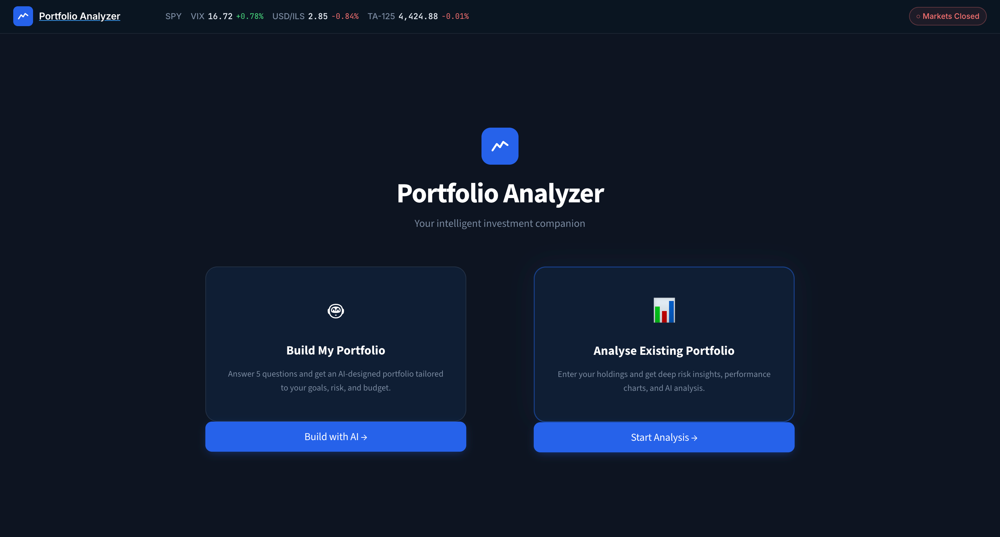
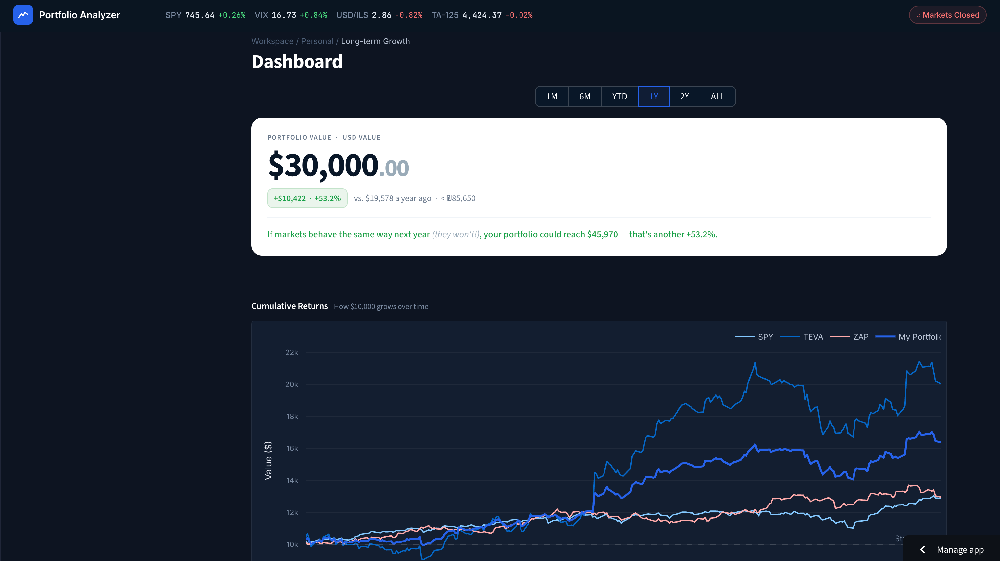
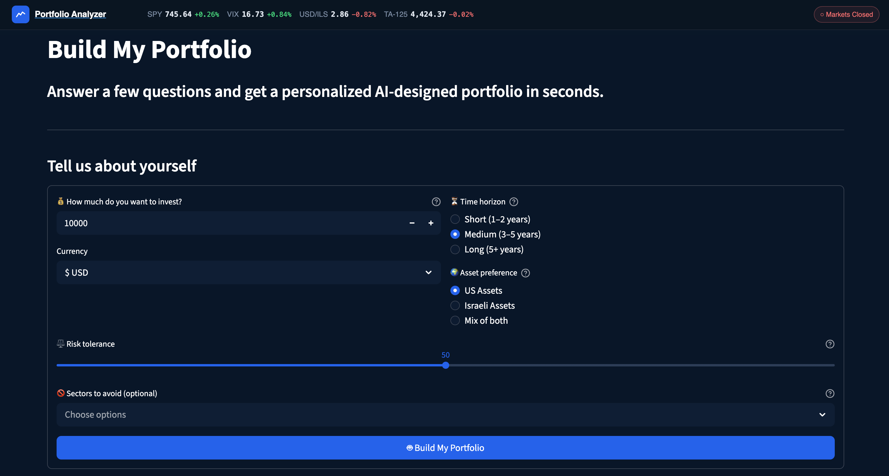

# Portfolio Analyzer — AI-Powered Investment Analysis Tool

[](https://portfolio-analyzer-m8xhi4ew9sbezetiwb6ub4.streamlit.app)
[](https://python.org)

A full-stack web application for analyzing stock portfolios — built for young investors who want institutional-grade insights without a finance degree. Built with Python, Streamlit, and Claude API. Deployed and live.

---

## Live Demo
https://portfolio-analyzer-m8xhi4ew9sbezetiwb6ub4.streamlit.app

---

## Why I Built This
I wanted exposure to important tools and learn how to build a real full-stack app. I saw the need to visualize my own portfolio as an opportunity to work on exactly that — so I built something that answered a need I had while letting me get hands-on with Python, Streamlit, and the Claude API in practice.

---

## Screenshots







---

## What it does

- Build and analyze a portfolio with support for ILS and USD
- Search stocks, ETFs, and indices (data from Yahoo Finance)
- See per-asset risk metrics: volatility, Sharpe ratio, Beta, max drawdown, VaR (95%), and correlation
- Compare against SPY or the Tel Aviv 125 index across 6M, 1Y, 2Y, or 5Y windows
- Run Markowitz optimization to find the efficient frontier and suggested weight allocation
- Backtest against real historical data using vectorbt
- Get personalized analysis from Claude (Anthropic's AI) in plain language
- Use the portfolio builder to answer 5 questions and get 3 AI-designed portfolio options

---

## Tech stack

| Layer | Library |
|---|---|
| UI | Streamlit |
| Market data | yfinance |
| Charts | Plotly |
| Math / risk | pandas, NumPy, SciPy |
| Optimization | PyPortfolioOpt |
| Backtesting | vectorbt |
| AI | Claude API (Anthropic) |
| Language | Python 3.11 |

---

## Running locally

Requires Python 3.11+.

```bash
git clone https://github.com/itamarlevy10/portfolio-analyzer.git
cd portfolio-analyzer

python -m venv venv
source venv/bin/activate       # macOS / Linux
# venv\Scripts\activate        # Windows

pip install -r requirements.txt
```

To enable the AI advisor, add your Anthropic API key:

```bash
mkdir -p .streamlit
echo 'ANTHROPIC_API_KEY = "sk-ant-..."' > .streamlit/secrets.toml
```

Then run:

```bash
streamlit run app.py
```

Opens at `http://localhost:8501`.

---

## Project structure

```
portfolio_analyzer/
├── app.py              # Navigation entrypoint
├── pages/
│   ├── analyze.py      # Main analysis page — sidebar, charts, metrics, AI advisor
│   └── 1_Build_My_Portfolio.py  # AI portfolio builder questionnaire
├── main.py             # Data layer — fetch prices, build portfolio, sectors
├── risk_metrics.py     # Risk calculations — Sharpe, Beta, VaR, drawdown, correlation
├── optimizer.py        # Efficient frontier and weight optimization
├── backtester.py       # Historical simulation via vectorbt
├── requirements.txt
└── .streamlit/
    └── secrets.toml    # API keys (not committed)
```

---

Built by [Itamar Levy](mailto:itamarlevy10@gmail.com)
